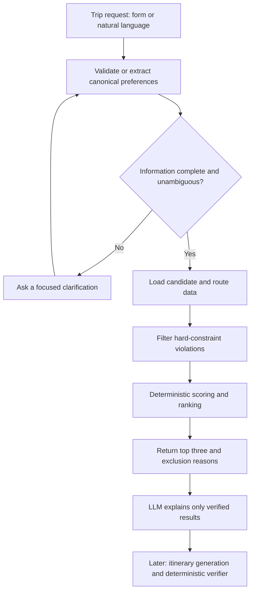

# Travel AI - Project Proposal

**Owners:** Winnie and Ivy  
**Status:** Week 0 complete; beginning Week 1  
**Working name:** Travel AI  
**Goal:** Build a reliable, portfolio-ready Applied AI system that helps two
people who live in different places choose a fair shared-trip destination.

## 1. Problem and product vision

Planning a trip together is difficult when the travelers start in different
cities: the cheapest destination for one person may be expensive or
inconvenient for the other. Travel AI makes that decision transparent.

Given two travelers' origins, fixed leisure-trip dates, individual budgets,
maximum travel times, and preferences, the system recommends the **top three
eligible U.S. destinations**. Each result shows estimated per-traveler cost
and travel time, a fairness view, a score breakdown, and the relevant
tradeoffs. It also explains why other destinations were excluded.

The v2 direction is a structured itinerary for the destination the users
select. That itinerary will be generated from verified activity data and
checked deterministically for feasibility.

This project is intentionally designed as a showcase for Applied AI Engineer
roles: it combines typed backend development, structured LLM outputs, tool or
provider integration, deterministic decision logic, evaluation, reliability,
and deployment. The aim is a dependable decision system, not just a travel
chatbot.

## 2. V1 scope

### Users and trip model

- Exactly two travelers who live in different places, such as long-distance
  couples or friends.
- Fixed leisure-trip dates, initially 3-7 days.
- A controlled pool of 15-25 U.S. cities.
- Per-person origin, budget, maximum travel time, and preferences.
- Initial preference vocabulary: temperature range, interests (for example,
  beach, food, museums, nightlife, nature, and shopping), and vibes (lively,
  relaxed, outdoors, and luxury).

### Recommendation output

- Three ranked, eligible destinations whenever at least three qualify.
- Per-traveler estimated round-trip cost and travel duration.
- Total trip-cost estimate, fairness indicators, and normalized score
  components.
- Plain-language explanation grounded only in verified result data.
- Machine-readable rejection reasons when a destination fails a hard
  constraint.

## 3. Use cases

### Use case 1 - Choose a fair destination

Two friends live in different cities and want to take a five-day trip together.
They provide their origins, dates, individual budgets, maximum travel times,
and preferences such as warm weather, food, and nature. Travel AI filters out
ineligible cities and returns the three best options, showing each person's
estimated travel time and cost, the fairness tradeoff, and the reasons each
destination ranked where it did.

### Use case 2 - Turn a natural-language request into a complete trip request

A user says, “My friend is in Boston and I am in San Francisco. We each have
about $2,000 and want somewhere warm with great food in October.” The system
extracts the fields it can safely identify, then asks focused follow-up
questions for missing details such as exact dates or maximum travel time. Only
after the user confirms a valid canonical request does the deterministic
recommendation flow run.

### Use case 3 - Explain why no destination qualifies

Two travelers provide constraints that no city in the initial candidate pool
can satisfy, such as a very low budget combined with a short maximum travel
time. Instead of inventing an answer, Travel AI returns no recommendation,
identifies the constraints that excluded each candidate, and suggests which
constraint the travelers could relax.

### Use case 4 - Compare tradeoffs between eligible destinations

The top option may be cheapest while the second option offers a much more
balanced journey. Travelers can compare verified cost, travel-time, fairness,
weather, and preference-match components rather than relying on an opaque
single score. This supports a shared decision without claiming that one
preference is universally more important than another.

### Use case 5 - Generate a verified itinerary (v2)

After the travelers select a recommended destination, they can request a
daily itinerary. The LLM drafts a structured schedule from retrieved activity
data, while deterministic checks validate timing, budget, travel plausibility,
availability assumptions, and evidence. If verification fails, the system
returns precise issues and allows a limited correction attempt.

## 4. Non-goals

The following are explicitly out of scope for v1:

- Booking, payment, or checkout flows.
- Worldwide coverage, visa guidance, or currency conversion.
- Groups larger than two travelers.
- Fine-tuning, a learned ranker, or a personalization model in the core
  product.
- A RAG/vector database or multi-agent framework without a demonstrated need.
- A complex frontend before the API, recommendation engine, and evaluation
  suite are working.
- Fully accurate real-time hotel pricing; estimates are clearly labeled.

## 5. Design principle: AI where language is messy

The system separates probabilistic language tasks from calculations and facts
that must be correct and reproducible.

| LLM responsibilities | Deterministic engineering responsibilities |
| --- | --- |
| Extract preferences from natural-language input | Validate schemas and input ranges |
| Ask clarification questions for missing or ambiguous fields | Load provider or fixture data |
| Explain verified recommendations and tradeoffs | Enforce budget and travel-time constraints |
| Draft a later itinerary from verified activity data | Calculate costs, fairness, scores, ranking, and tie-breaking |
| Revise an itinerary after verifier feedback | Verify itinerary feasibility, provenance, and freshness |

The LLM must not invent prices, travel times, weather facts, eligibility
decisions, opening times, or ranking scores.

## 6. Recommendation workflow



The canonical request schema is the boundary between user wording and
reproducible computation. Required fields are origins, dates, per-person
budget, maximum travel time, and preferences. The system asks for clarification
when a value is missing, ambiguous, or cannot be safely mapped to the
controlled vocabulary.

### Flight-offer selection policy

After hard constraints remove ineligible flight offers, the system builds every
valid combination of one round-trip offer per traveler for a candidate city.
Every valid pair receives a separate, auditable selection score based on
combined price, arrival alignment, combined travel time, connections, and
time together. Price is penalized continuously relative to the cheapest
valid pair; the selector does not use a fixed percentage price guardrail.

The pair score chooses flights within one city. It is distinct from the final
destination score, which ranks cities using the recommended pair's raw flight
features plus the travelers' city and climate preferences. The destination
ranker never treats the pair score itself as a ranking component.

Arrival alignment receives full pair-score credit within two hours, declines
linearly until six hours, and receives zero credit after six hours. Poor arrival
alignment alone does not make a city ineligible. Time together accounts for
the later arrival and earlier return departure, so incompatible return
schedules also reduce pair quality.

Connecting offers remain eligible and receive a continuous connection penalty.
The pair score averages the two travelers' individual connection scores, so one
traveler's single connection does not halve the entire pair's connection score.
V1 does not accept a `nonstop_only` request field. Pair-score ties are resolved
by lower combined cost, shorter combined travel time, smaller arrival gap,
fewer connections, longer time together, and stable offer IDs.

The customer receives up to four distinct offers per traveler: the recommended
pair offer plus the lowest-price, shortest-travel, and fewest-connections
category winners. When one offer wins multiple categories, it is returned once
with multiple labels; the service does not add an arbitrary backfill option.

The airport-resolution, synchronized-arrival pairing, and four-category option
selection rules are defined in [Flight search and pairing](flight-search-and-pairing.md).

Origin cities do not need to appear in the destination candidate pool. Duffel
Place Suggestions resolves a user's confirmed city or airport text into city
and airport candidates. A versioned airport-reference snapshot then filters for
scheduled large or medium commercial airports, ranks explicit selections and
nearby airports deterministically, and returns at most three airport codes. The
LLM must not invent airport codes, coordinates, commercial-service status, or
airport priority.

For V1, origins are limited to an explicit airport/IATA code or a city plus
state. If several verified place results are plausible, the LLM asks the user
to choose among them. Arbitrary addresses and geocoding are deferred. The
filtered, versioned OurAirports reference snapshot is stored at
`src/travel_ai/fixtures/airport_reference.json`; its source date and schema
version are recorded. It is refreshed quarterly and before a tagged demo or
release, whichever comes first, as an explicit release task.

## 7. Data strategy

The MVP uses versioned JSON fixtures validated with Pydantic. This keeps local
development, testing, and ranking results repeatable before external APIs are
introduced.

- `cities.json`: stable city metadata, airport code, interest tags, and vibe
  scores.
- `weather_profiles.json`: city-specific monthly weather profiles.
- `route_estimates.json`: origin-to-destination round-trip duration and price
  estimates.
- `trip_costs.json`: hotel, food, and local-transport estimates.

Route cost and duration belong to route data rather than a city record because
they vary by origin and dates. Provider interfaces will later allow one live
data source while retaining recorded fixtures as a reliable fallback.

### Candidate-pool and preference-normalization approach

The candidate pool is a small, typed catalog of cities. During the MVP it is
stored as versioned JSON fixtures; conceptually, each JSON record is a row in a
city table. If the project later adopts SQLite or PostgreSQL, the same
contracts can become database tables without changing the recommendation
logic.

Each city record contains stable attributes that can be compared with a user's
preferences. For example:

```json
{
  "city_id": "san_diego_ca",
  "name": "San Diego",
  "airport_code": "SAN",
  "country": "US",
  "interest_tags": ["beach", "food", "nature"],
  "vibe_tags": ["relaxed", "outdoors"],
  "weather_profile_id": "san_diego_ca",
  "accessibility_tags": ["walkable"],
  "data_version": "v1"
}
```

The LLM reads natural-language input only to produce validated, **per-traveler**
preferences using the same controlled vocabulary as the catalog. For example,
“somewhere warm with great food and hiking” becomes structured fields such as
a temperature range, `interest_tags: ["food", "outdoor_activities"]`, and
`vibe_tags: ["outdoors"]` for the traveler who expressed them. It must ask a
clarification question when a value is missing or cannot be safely mapped. The
full definitions of hard constraints, soft preferences, score behavior, and
unsupported-preference handling are in the [preference and request
contract](preference-and-request-contract.md).

```json
{
  "travelers": [
    {
      "origin": "Boston, MA",
      "budget_usd": 2000,
      "max_travel_time_hours": 8,
      "preferences": {"interest_tags": ["food"], "vibe_tags": ["lively"]}
    },
    {
      "origin": "San Francisco, CA",
      "budget_usd": 1800,
      "max_travel_time_hours": 7,
      "preferences": {"interest_tags": ["nature"], "vibe_tags": ["relaxed"]}
    }
  ],
  "start_date": "2026-10-09",
  "end_date": "2026-10-13"
}
```

Deterministic code then joins the normalized preferences with the city,
weather, route, and trip-cost records; filters hard constraints; calculates
feature scores; and ranks the eligible cities. The LLM never reads through the
candidate pool to select a winner and never assigns a score. This preserves
repeatability and makes each recommendation explainable.

## 8. Constraints and explainable ranking

Hard constraints filter a city out; they are not score penalties. The initial
hard constraints are distinct resolved origins, per-person budget, maximum
one-way travel duration, valid future dates, and required data availability.

Eligible cities receive an explainable weighted score:

```text
score = w_cost * cost_score
      + w_time * travel_time_score
      + w_fairness * fairness_score
      + w_weather * weather_score
      + w_preference * preference_match_score
```

All components are normalized before scoring and their definitions, missing
data behavior, weights, and tie-breaking rules are documented. Fairness is
reported separately from total burden so an equal but poor journey for both
travelers is not mistaken for a good outcome. At minimum, the system reports:

```text
fairness_gap = abs(travel_hours_A - travel_hours_B)
```

The ranking may also include the difference in traveler costs. The initial
weights are a baseline to evaluate, not a claim of universal correctness.

## 9. Technical approach

Travel AI will start as a modular monolith with typed contracts:

- Python, FastAPI, and Pydantic.
- pytest and Ruff for automated testing and code quality.
- GitHub Actions for continuous integration.
- Docker for repeatable local development and eventual deployment; this is the
  current plan and can be reconsidered if the project needs change.
- Provider interfaces with fixture-based fallback.
- A simple UI only after the API, ranking, and evaluation flow are stable.

The architecture will avoid premature microservices, Kubernetes, and agent
frameworks. Any later database, tracing implementation, or UI framework will
be selected to support demonstrated needs.

Winnie owns the initial LLM integration. **DeepSeek V4 Flash in non-thinking
mode** will be used for low-cost initial extraction tests, with Pydantic
validation required after every response. A benchmark against GPT-5 mini and
Gemini Flash-Lite will determine the later default model; no model may bypass
the canonical schema or deterministic recommendation engine. See
[LLM selection](llm-selection.md) for the testing decision, benchmark gate,
and provider-neutral logging contract.

## 10. Quality, reliability, and evaluation

Evaluation is a product feature. We will build a versioned test set that
covers normal requests, missing fields, ambiguous requests, impossible trips,
constraint boundaries, provider failures, prompt injection, time-zone/date
edge cases, and preference changes.

Flight-pair policy examples belong in
`evals/flight_pair_selection_cases.json`. Each labeled case contains the two
travelers' eligible offers, the expected recommended offer IDs, and a short
reason describing the intended tradeoff. Unit tests verify formulas and
invariants; this evaluation set checks whether the chosen weights, arrival
thresholds, and connection penalty produce useful product decisions.

We will track metrics appropriate to each layer:

- Extraction: schema-valid rate and required-field accuracy.
- Constraints: hard-constraint violation rate, with a target of zero.
- Ranking: top-three agreement or NDCG@3 against labeled cases.
- Explanations: unsupported-claim rate.
- Reliability: end-to-end and fallback success rates.
- Operations: p50/p95 latency, model-token usage, and estimated cost per
  successful request.

The project will compare a simple baseline (such as cheapest eligible city or
keyword extraction) with the structured, deterministic workflow. Observed
failures become documented limitations and regression tests rather than being
hidden.

## 11. Ownership

### Winnie - Applied AI and product systems

- Product and request/response schemas.
- LLM structured outputs, clarification flow, orchestration, and grounded
  explanations.
- FastAPI service, deployment, observability, latency/cost measurements, and
  end-to-end evaluation.
- Later itinerary integration.

### Ivy - ranking and data systems

- Destination/activity data, fixture contracts, and data quality.
- Ranking features, deterministic ranking engine, and offline ranking metrics.
- Experiments and the optional learned-ranker extension after the core release.

### Shared

- Constraint rules, architecture decisions, acceptance criteria, failure
  taxonomy, code reviews, documentation, demo, and final report.

## 12. Delivery definition

The core project is successful when a user can submit a valid two-traveler
request, receive deterministic and explainable top-three recommendations, see
why excluded cities failed, and use a deployed demo backed by tests and an
evaluation report. The portfolio package will include the architecture,
evaluation results, limitations, demo video, and distinct contribution
statements for Winnie and Ivy.

See [the project timeline](project-timeline.md) for the week-by-week plan and
acceptance criteria, and [the LLM selection](llm-selection.md) for the initial
provider decision.
