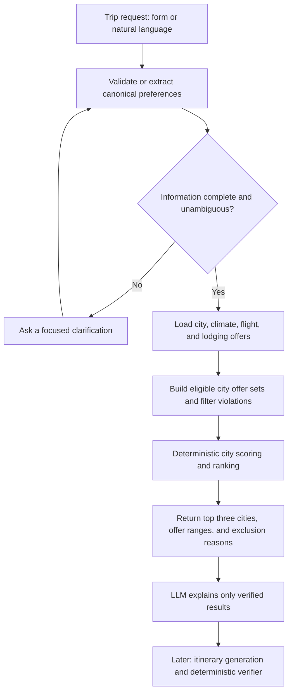

# Travel AI - Project Proposal

**Owners:** Winnie and Ivy  
**Status:** Week 1 complete; beginning Week 2
**Working name:** Travel AI  
**Goal:** Build a reliable, portfolio-ready Applied AI system that helps two
people who live in different places choose a fair shared-trip destination.

## 1. Problem and product vision

Planning a trip together is difficult when the travelers start in different
cities: the cheapest destination for one person may be expensive or
inconvenient for the other. Travel AI makes that decision transparent.

Given two travelers' origins, fixed leisure-trip dates, individual budgets,
maximum travel times, and preferences, the system recommends the **top three
eligible U.S. destinations**. Each city result shows estimated per-traveler
cost and travel time, a fairness view, a score breakdown, and the relevant
tradeoffs. It also includes a small, compatible range of flight choices for
each traveler and lodging choices for the pair, so users can make the final
flight-and-hotel tradeoff instead of being forced into one itinerary. It also
explains why other destinations were excluded.

The v2 direction is a structured itinerary for the destination the users
select. That itinerary will be generated from verified activity data and
checked deterministically for feasibility.

This project is intentionally designed as a showcase for Applied AI Engineer
roles: it combines typed backend development, structured LLM outputs, tool or
provider integration, deterministic decision logic, evaluation, reliability,
and deployment. The aim is a dependable decision system, not just a travel
chatbot.

## 2. V1 scope

### Users and trip model

- Exactly two travelers who live in different places, such as long-distance
  couples or friends.
- Fixed leisure-trip dates, initially 3-7 days.
- An initial controlled pool of 10 U.S. cities, expanded to 15-25 before the
  portfolio release.
- Per-person origin, budget, maximum travel time, and preferences.
- Initial preference vocabulary: temperature range, interests (for example,
  beach, food, museums, nightlife, nature, and shopping), and vibes (lively,
  relaxed, outdoors, and luxury).

### Recommendation output

- Three ranked, eligible city recommendations whenever at least three qualify.
- Up to three compatible flight offers for each traveler and up to three
  lodging offers for the pair in each returned city; offers are selected and
  sorted by fixed, documented rules.
- A city-level reference package used only for comparable cost, fairness, and
  travel-time scoring. It is not presented as a fixed customer package:
  travelers can independently choose a flight each and one shared lodging
  option.
- Per-traveler estimated round-trip cost and travel duration, with offer
  freshness and source information.
- Flight-and-lodging estimate, fairness indicators, and normalized score
  components for the reference package.
- Plain-language explanation grounded only in verified result data.
- Machine-readable rejection reasons when a destination fails a hard
  constraint.

## 3. Use cases

### Use case 1 - Choose a fair destination

Two friends live in different cities and want to take a five-day trip together.
They provide their origins, dates, individual budgets, maximum travel times,
and preferences such as warm weather, food, and nature. Travel AI filters out
ineligible cities and returns the three best city options, showing each
person's estimated travel time and cost, the fairness tradeoff, compatible
flight and hotel choices, and the reasons each destination ranked where it
did.

### Use case 2 - Turn a natural-language request into a complete trip request

A user says, “My friend is in Boston and I am in San Francisco. We each have
about $2,000 and want somewhere warm with great food in October.” The system
extracts the fields it can safely identify, then asks focused follow-up
questions for missing details such as exact dates or maximum travel time. Only
after the user confirms a valid canonical request does the deterministic
recommendation flow run.

### Use case 3 - Explain why no destination qualifies

Two travelers provide constraints that no city in the initial candidate pool
can satisfy, such as a very low budget combined with a short maximum travel
time. Instead of inventing an answer, Travel AI returns no recommendation,
identifies the constraints that excluded each candidate, and suggests which
constraint the travelers could relax.

### Use case 4 - Compare cities and choose compatible offers

The top option may be cheapest while the second option offers a much more
balanced journey. Within each city, travelers can compare a small list of
compatible flight offers for each person and shared lodging offers. Across
cities, they can compare verified cost, travel-time, fairness, and
preference-match components rather than relying on an opaque single score.
This supports a shared decision without claiming that one preference is
universally more important than another.

### Use case 5 - Generate a verified itinerary (v2)

After the travelers select a recommended destination, they can request a
daily itinerary. The LLM drafts a structured schedule from retrieved activity
data, while deterministic checks validate timing, budget, travel plausibility,
availability assumptions, and evidence. If verification fails, the system
returns precise issues and allows a limited correction attempt.

## 4. Non-goals

The following are explicitly out of scope for v1:

- Booking, payment, or checkout flows.
- Worldwide coverage, visa guidance, or currency conversion.
- Groups larger than two travelers.
- Fine-tuning, a learned ranker, or a personalization model in the core
  product.
- Food and local-transport cost estimates; these are deferred to v2 with the
  itinerary work.
- A RAG/vector database or multi-agent framework without a demonstrated need.
- A complex frontend before the API, recommendation engine, and evaluation
  suite are working.
- Fully accurate real-time hotel pricing; estimates are clearly labeled.

## 5. Design principle: AI where language is messy

The system separates probabilistic language tasks from calculations and facts
that must be correct and reproducible.

| LLM responsibilities | Deterministic engineering responsibilities |
| --- | --- |
| Extract preferences from natural-language input | Validate schemas and input ranges |
| Ask clarification questions for missing or ambiguous fields | Load provider or fixture data |
| Explain verified recommendations and tradeoffs | Enforce budget and travel-time constraints |
| Draft a later itinerary from verified activity data | Calculate costs, fairness, scores, ranking, and tie-breaking |
| Revise an itinerary after verifier feedback | Verify itinerary feasibility, provenance, and freshness |

The LLM must not invent prices, travel times, weather facts, eligibility
decisions, opening times, or ranking scores.

## 6. Recommendation workflow



The canonical request schema is the boundary between user wording and
reproducible computation. Required fields are origins, dates, per-person
budget, maximum travel time, and preferences. The system asks for clarification
when a value is missing, ambiguous, or cannot be safely mapped to the
controlled vocabulary.

## 7. Data strategy

The MVP uses versioned JSON fixtures validated with Pydantic. This keeps local
development, testing, and ranking results repeatable before external APIs are
introduced.

- `cities.json`: stable city metadata, airport code, interest tags, and vibe
  scores.
- `monthly_climate.json`: city-specific monthly climate summaries.
- `flight_offers.json`: multiple origin-to-destination flight offers per
  traveler route, including price, duration, stops, eligibility details, and
  quote-freshness information.
- `lodging_offers.json`: multiple lodging offers per destination, including
  total stay price, occupancy assumption, stay dates, quality attributes, and
  quote-freshness information.

Flight and lodging offers belong to date-aware offer data rather than city
records because prices vary by origin, dates, occupancy, and availability.
Provider interfaces will later allow live flight and lodging sources while
retaining recorded fixtures as a reliable fallback.

### City recommendations with selectable offer ranges

The unit being ranked is a **city**, not an individual flight or hotel. A city
qualifies only when both travelers have at least one eligible flight offer and
the pair has at least one eligible lodging offer for the same trip dates and
occupancy. The response then returns a bounded, sorted subset of those offers
so users can choose based on their own tradeoffs.

To make city scores comparable, the system also creates a deterministic
**reference package** for each eligible city. For the MVP, it is the
lowest-total-cost eligible combination of one flight per traveler and one
shared lodging offer. Fixed tie-breakers use shorter total travel time, fewer
stops, and then stable provider offer IDs. The reference package is used for
ranking only; it does not remove the other compatible choices from the
response.

### Recommendation flow and customer choice

Travel AI recommends a **city**, not a pre-built flight-and-hotel bundle. The
following flow keeps the ranking reproducible while allowing the travelers to
make their own tradeoffs:

1. The LLM converts the conversation into a validated `TripRequest`.
2. For every city in the candidate pool, Travel AI obtains flight offers for
   each traveler and lodging offers for the pair. During the MVP, providers
   load versioned fixture data; a future adapter may obtain live data.
3. Provider results are validated and normalized into internal `FlightOffer`
   and `LodgingOffer` records with a source, retrieval time, and freshness
   information. The ranker never depends on raw provider JSON.
4. The constraint engine removes individual offers with the wrong dates,
   destination, occupancy, availability, expired quote, or excessive travel
   time.
5. The system forms all remaining combinations of one flight for Traveler A,
   one flight for Traveler B, and one shared lodging offer. It removes a
   combination when either person's flight price plus half the lodging price
   exceeds that person's budget.
6. A city is eligible when at least one combination remains. Its
   lowest-total-cost eligible combination becomes the reference package.
7. The ranker scores eligible cities from their reference packages: 35%
   affordability, 30% travel fairness, 20% preference match (including
   climate), and 15% travel time. It returns the three highest-ranked cities.
8. For every returned city, the API presents independent choices: up to three
   flights for Traveler A, up to three flights for Traveler B, and up to three
   shared lodging options. The reference-package components are always
   included and labeled.
9. When travelers select different options, the client recalculates each
   person's total, combined total, budget status, and fairness. A selected
   combination can be shown with a budget warning; it does not silently alter
   the city ranking.

Displayed flight choices are selected as lowest price, shortest travel time,
and fewest stops. Displayed lodging choices are selected as lowest total
price, best reviewed, and most flexible cancellation, subject to the available
fixture data. If the same offer wins more than one category, the system uses
the next deterministic choice instead.

An offer is compatible when it matches the requested dates, destination,
occupancy assumptions, and the applicable hard constraints. Before building
fixtures or adapters, the team will document the exact minimum hotel-quality
rule, number of options returned, budget rule, and treatment of unavailable or
expired offers.

### Candidate-pool and preference-normalization approach

The candidate pool is a small, typed catalog of cities. During the MVP it is
stored as versioned JSON fixtures; conceptually, each JSON record is a row in a
city table. If the project later adopts SQLite or PostgreSQL, the same
contracts can become database tables without changing the recommendation
logic.

Each city record contains stable attributes that can be compared with a user's
preferences. For example:

```json
{
  "city_id": "san_diego_ca",
  "name": "San Diego",
  "airport_code": "SAN",
  "country": "US",
  "interest_tags": ["beach", "food", "nature"],
  "vibe_tags": ["relaxed", "outdoors"],
  "weather_profile_id": "san_diego_ca",
  "accessibility_tags": ["walkable"],
  "data_version": "v1"
}
```

The LLM reads natural-language input only to produce a validated, canonical
preference object using the same controlled vocabulary as the catalog. For
example, “somewhere warm with great food and hiking” becomes structured fields
such as `temperature_range_c`, `interest_tags: ["food", "nature"]`, and
`vibe_tags: ["outdoors"]`. It must ask a clarification question when a value
is missing or cannot be safely mapped.

```json
{
  "travelers": [
    {"origin": "Boston, MA", "budget_usd": 2000, "max_travel_hours": 8},
    {"origin": "San Francisco, CA", "budget_usd": 2000, "max_travel_hours": 8}
  ],
  "dates": {"start": "2026-10-09", "end": "2026-10-13"},
  "temperature_range_c": {"min": 20, "max": 30},
  "interest_tags": ["food", "nature"],
  "vibe_tags": ["outdoors"]
}
```

Deterministic code then joins the normalized preferences with the city, climate,
flight-offer, and lodging-offer records; constructs eligible offer sets;
calculates feature scores; and ranks the eligible cities. The LLM never reads
through the candidate pool to select a winner and never assigns a score. This
preserves repeatability and makes each recommendation explainable.

## 8. Constraints and explainable ranking

Hard constraints filter a city out; they are not score penalties. The initial
hard constraints are per-person budget, maximum travel duration, supported
region, valid dates, and required data availability.

Eligible cities receive an explainable weighted score:

```text
score = 0.35 * affordability_score
      + 0.30 * travel_fairness_score
      + 0.20 * preference_match_score
      + 0.15 * travel_time_score
```

All components are normalized to the same range before scoring and their
definitions, missing-data behavior, weights, and tie-breaking rules are
documented. `preference_match_score` includes both controlled city tags and
the match between the requested temperature range and the city's monthly
climate summary; climate is not a separate score. Affordability, fairness, and
travel time are calculated from the reference package. Fairness is reported
separately from total burden so an equal but poor journey for both travelers is
not mistaken for a good outcome. At minimum, the system reports:

```text
fairness_gap = abs(travel_hours_A - travel_hours_B)
```

The ranking may also include the difference in traveler costs. The listed
weights are the initial baseline to evaluate, not a claim of universal
correctness.

## 9. Technical approach

Travel AI will start as a modular monolith with typed contracts:

- Python, FastAPI, and Pydantic.
- pytest and Ruff for automated testing and code quality.
- GitHub Actions for continuous integration.
- Docker for repeatable local development and eventual deployment; this is the
  current plan and can be reconsidered if the project needs change.
- Provider interfaces with fixture-based fallback.
- A simple UI only after the API, ranking, and evaluation flow are stable.

The architecture will avoid premature microservices, Kubernetes, and agent
frameworks. Any later database, tracing implementation, or UI framework will
be selected to support demonstrated needs.

Winnie owns the initial LLM integration. **DeepSeek V4 Flash in non-thinking
mode** will be used for low-cost initial extraction tests, with Pydantic
validation required after every response. A benchmark against GPT-5 mini and
Gemini Flash-Lite will determine the later default model; no model may bypass
the canonical schema or deterministic recommendation engine. See
[LLM selection](llm-selection.md) for the testing decision, benchmark gate,
and provider-neutral logging contract.

## 10. Quality, reliability, and evaluation

Evaluation is a product feature. We will build a versioned test set that
covers normal requests, missing fields, ambiguous requests, impossible trips,
constraint boundaries, provider failures, prompt injection, time-zone/date
edge cases, and preference changes.

We will track metrics appropriate to each layer:

- Extraction: schema-valid rate and required-field accuracy.
- Constraints: hard-constraint violation rate, with a target of zero.
- Ranking: top-three agreement or NDCG@3 against labeled cases.
- Explanations: unsupported-claim rate.
- Reliability: end-to-end and fallback success rates.
- Operations: p50/p95 latency, model-token usage, and estimated cost per
  successful request.

The project will compare a simple baseline (such as cheapest eligible city or
keyword extraction) with the structured, deterministic workflow. Observed
failures become documented limitations and regression tests rather than being
hidden.

## 11. Ownership

### Winnie - Applied AI and product systems

- Product and request/response schemas.
- LLM structured outputs, clarification flow, orchestration, and grounded
  explanations.
- FastAPI service, deployment, observability, latency/cost measurements, and
  end-to-end evaluation.
- Later itinerary integration.

### Ivy - ranking and data systems

- Destination/activity data, fixture contracts, and data quality.
- Ranking features, deterministic ranking engine, and offline ranking metrics.
- Experiments and the optional learned-ranker extension after the core release.

### Shared

- Constraint rules, architecture decisions, acceptance criteria, failure
  taxonomy, code reviews, documentation, demo, and final report.

## 12. Delivery definition

The core project is successful when a user can submit a valid two-traveler
request, receive deterministic and explainable top-three recommendations, see
why excluded cities failed, and use a deployed demo backed by tests and an
evaluation report. The portfolio package will include the architecture,
evaluation results, limitations, demo video, and distinct contribution
statements for Winnie and Ivy.

See [the project timeline](project-timeline.md) for the week-by-week plan and
acceptance criteria, and [the LLM selection](llm-selection.md) for the initial
provider decision.
